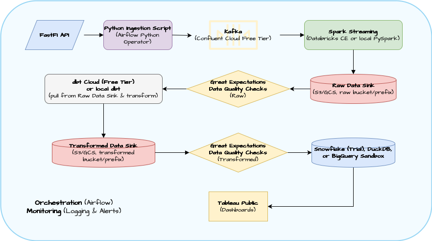

# streaming Project Directory

This project leverages data from the FastF1 API in service of multiple objectives:

1. Ingest and expose driver telemetry and session detail (i.e., lap progress in race or qualifying sessions) as streaming data, comparable to real-time trading analytics in finance applications.

2. Analyze the telemetry data to compare driving styles, particularly among teammates.

3. Leverage session detail to discern and visualize key events in narrative fashion ("race stories").

## Features (Planned)
- Real-time telemetry streaming
- Driver comparison analytics
- Race event visualization

## Project Structure

This repository contains the following files and directories:

- `src`: Directory for Python scripts
- `docs`: Directory for reference and EDA materials such as Jupyter notebooks
- `requirements.txt`: File specifying Python dependencies

## Solution Architecture



## Installation

1. Clone the repository:
```sh
git clone https://github.com/AnthonyDalke/f1data/streaming
cd streaming
```

2. Install requirements

## Acknowledgments
- [FastF1](https://theoehrly.github.io/Fast-F1/)

## Contact
If you have any questions or feedback, feel free to contact me directly, at anthony.dalke@gmail.com. Thank you for visiting!